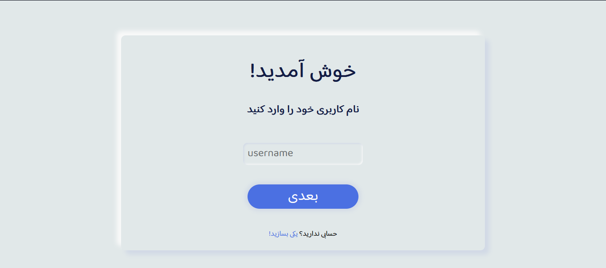
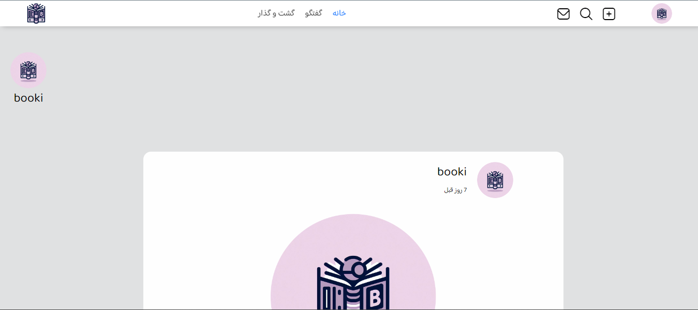
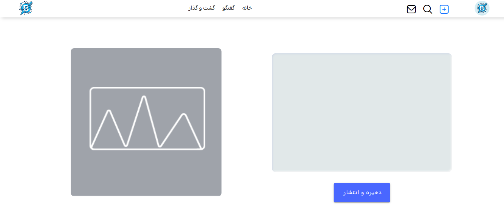
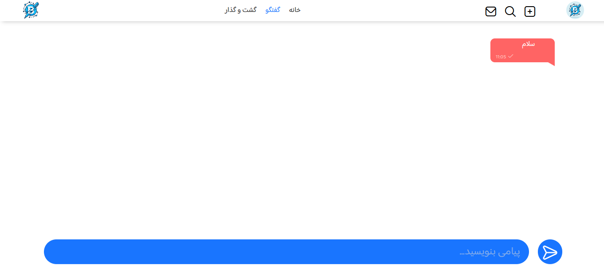

# Booki
a social network website for everyone<br>
with chatroom, posts, AI search, notifications and other

## Technology
- Python 3.11
- Flask
- Vue.js
- Vuetify.js
- UIcons
- Google Fonts

## Use
``` powershell
./run.bat
```
note: this app only supports in python 3.11

## Demo




online demo in codeSandBox: 