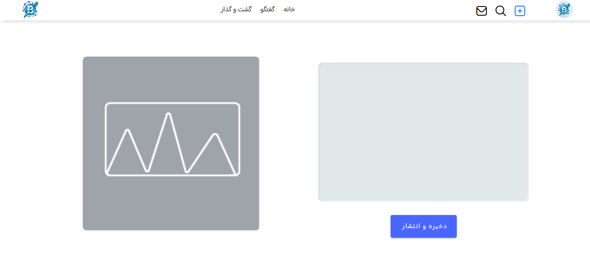
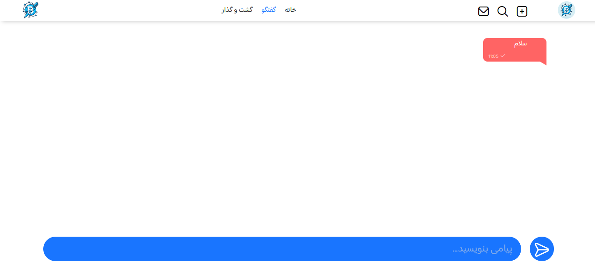

# شروع کار با وبسایت

## ورود

هنگام ورود، همچین صفحه ای را مشاهده می کنید، در این صفحه، در صورتی که حساب کاربری دارید، نام کاربری خود را وارد کنید. 
پس از آن، یک آواتار می بینید، در صورتی که آن، آواتار شما بود، رمز خود را وارد کنید، و وارد شوید 
در صورتی که حساب ندارید، روی "یکی بسازید!" کلیک کنید و مراحل را طی کنید. 
[اطلاعات بیشتر در مورد ثبت نام](./register.md)

## صفحه اول

این صفحه اول وبسایت است، در این صفحه، شما در بالا نوار دسترسی را می بینید، در آن، گزینه اول، عکس آواتار شما است و با زدن روی آن به صفحه پروفایل خود می روید.
برای اطلاعات بیشتر در مورد پروفایل خود، به[ اینجا ](./profile.md)سر بزنید.  

گزینه بعدی که علامت بعلاوه دارد، گزینه افزودن پست است، با زدن آن گزینه، به صفحه افزودن پست هدایت می شوید، در آن صفحه می توانید یک پست اضافه کنید. 
برای 
برای اطلاعات بیشتر در مورد افزودن پست، به[ اینجا ](./add.md)سر بزنید.  

گزینه بعدی که علامت جستجو دارد، صفحه جستجو را برای شما بالا می آورد و با جستجو، می توانید پست مورد نظر خود را پیدا کنید.  
گزینه بعدی که آیکون پیام ها را دارد، گزینه پیام های وبسایت به شما است، در آنجا می توانید پیام هایی مانند پست های لایک شده، دنبال کنندگان، ورود ها و خوش آمدگویی را ببینید. 
همچنین می توانید پیام ها را حذف کنید.
  
گزینه بعدی، خانه است، با زدن آن به صفحه اصلی وارد می شوید. 
بعد از آن، صفحه گفتگو است، در آن صفحه، شما می توانید بفرستید 
برای اطلاعات بیشتر در مورد صفحه گفتگو، به[ اینجا ](./chat.md)سر بزنید.  

گزینه بعدی گزینه گشت و گذار است، این صفحه، تمام کاربران وبسایت را به شما نمایش می دهد، آنها بر اساس میزان شباهت بیوگرافی شان به شما مرتب می شوند، پس بیوگرافی خود را با دقت تعیین کنید! 
برای اطلاعات بیشتر در مورد گشت و گذار و نحوه مرتب سازی کاربران به[ اینجا ](./explore.md)سر بزنید.  
در نوار بعدی، کاربران دنبال شده را خواهید دید، پست های آنها در زیر آن نوار مشاهده خواهند شد.   
موفق باشید!